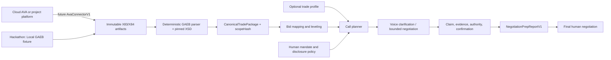

# GAEB-Native Construction Negotiator — Architecture Brief (Claus)

**Status:** implementation brief, not an implementation

**Date:** 2026-07-19

**Decision owner:** team

**Reference demo:** Tischlerarbeiten
**Near-term goal:** a defensible HackNation demo and a design-customer pilot, without pretending that every trade or AVA platform is already validated

## 1. Decision in one sentence

Build a **GAEB-native negotiation-preparation engine for any private, LV-based subcontractor trade**. The engine derives its scope from an immutable X83, levels submitted X84 bids, uses an evidence-carrying voice workflow to clarify and negotiate within a human mandate, and prepares the final human negotiation. Tischlerarbeiten is the reference-demo candidate and becomes “demonstrated and evaluated” only after the acceptance tests in this brief pass.

Recommended public wording after the reference evals pass:

> Upload any supported GAEB X83/X84 trade package. The Negotiator turns submitted bids into a scope-complete, supplier-confirmed preparation pack for the final human negotiation. Our HackNation reference implementation demonstrates Tischlerarbeiten.

Do not claim that the system:

- is technically validated for every Gewerk;
- understands every construction standard;
- is integrated with every AVA platform;
- creates a legally binding agreement through a phone recap;
- autonomously accepts, awards, or orders work; or
- is suitable for public, subsidized, sealed, or legally unclear procurement.

## 2. What the team should build

### Structurally supported for all LV-based trades

- deterministic X83/X84 ingestion;
- arbitrary nested LV areas, titles, lots, and positions;
- immutable source versions and hashes;
- position mapping and line-by-line Preisspiegel;
- detection of omissions, additions, alternates, quantity/unit changes, zero or missing prices, and hidden lump sums;
- factual clarification of scope inclusion, price, schedule, capacity, logistics, payment, validity, retention, security, and stated tax treatment;
- evidence, supplier recap, correction, and confirmation states;
- bounded commercial negotiation;
- a final human negotiation agenda.

### Target reference demo and evaluation

- GAEB DA XML 3.3 X83 plus three X84 bids;
- one private B2B Tischlerarbeiten package;
- three consenting human roleplayers;
- German calls with English subtitles;
- measurable improvement in price or an authorized commercial term;
- cross-trade structural conformance fixtures for Trockenbau and Elektro.

### Explicitly out of scope

- expert technical judgment across every trade;
- technical equivalence, safety, approval, fire, acoustic, structural, or engineering decisions;
- legal advice or procurement-law classification by the model;
- post-award changes, claims, defects, and delay disputes;
- bidder discovery or cold calling;
- autonomous award or acceptance;
- public procurement;
- live AVA integration without real API access;
- legacy D/P files, X84P, OCR as authoritative GAEB parsing, and A2A negotiation.

## 3. The architectural wedge

The wedge is not “a voice agent that asks for a discount.” That already exists as a generic capability. The wedge is **proof-carrying, scope-locked negotiation**:

1. Every call is tied to the exact X83 package and `scopeHash`.
2. Every commercial claim has evidence and a confirmation state.
3. The engine can prove why two bids are or are not comparable.
4. The agent can use competitive leverage only when a deterministic eligibility gate passes.
5. The output is a traceable preparation artifact, not a chat summary.
6. Trade expertise is added through versioned profiles without changing the core parser or inventing requirements.

This is defensible against generic voice platforms and procurement copilots because the product combines canonical construction scope, negotiation policy, evidence lineage, authority, and confirmation in one stateful workflow.

## 4. System boundary



GAEB is the standardized **content layer**. Compa, Campo, RIB, California, ORCA, NEVARIS, or another platform would each require a separate transport/authentication connector. The hackathon must label its source **Local GAEB fixture** and must not display a fake platform integration.

## 5. Non-negotiable design rules

### Deterministic authority, probabilistic assistance

Use deterministic code for:

- bytes, file identity, XML security, XSD validation, and phase/version checks;
- LV hierarchy and position identity;
- quantities, units, prices, totals, tax fields, and hashes;
- position mapping, arithmetic, and comparability blockers;
- state transitions, mandate bounds, leverage eligibility, and report calculations.

Use the language model only for:

- prioritizing already detected clarification questions;
- turning structured questions into natural German dialogue;
- mapping a spoken answer to a proposed structured claim;
- summarizing without changing authoritative technical text;
- suggesting a bounded negotiation move from allowed options.

Never let the model parse authoritative XML, silently repair a bid, invent a technical requirement, decide legal applicability, or commit the buyer.

### Immutable sources

- Store exact original X83/X84 bytes.
- Compute `sourceHash = SHA-256(original bytes)`.
- Treat every revised X84 as a new version.
- Never overwrite the supplier's artifact.
- Write confirmations and reports only as derived artifacts.

### One job equals one awardable package

One negotiation job represents one `Los` or otherwise awardable package. If an LV contains unrelated trades, propose a split but require human confirmation. Each package receives its own X83 projection, `scopeHash`, mandate, calls, and report. Do not compare or negotiate across package hashes.

## 6. Core contracts the implementation should freeze first

These are design contracts, not copy-paste production code.

### Connector boundary

```ts
interface AvaConnectorV1 {
  listTenderPackages(): Promise<TenderPackageRef[]>;
  listArtifacts(packageId: string): Promise<ArtifactRef[]>;
  fetchArtifact(ref: ArtifactRef): Promise<ImmutableArtifact>;
  pushDerivedArtifact(
    packageId: string,
    artifact: NegotiationPrepArtifact
  ): Promise<ExternalArtifactRef>;
}
```

Implement only `FixtureAvaConnector` for the hackathon. Keep authentication, pagination, retries, rate limits, and vendor-specific IDs outside the GAEB parser.

### Canonical package

```text
CanonicalTradePackage
- packageId and packageVersion
- tradeRaw, tradeNormalized, classificationSource, confidence
- tradeConfirmedByUser
- sourceArtifactManifest
- LV hierarchy and stable position identities
- quantities, units, and technical text preserved verbatim
- commercial, schedule, and execution requirements present in X83
- sourceHash list
- scopeHash and canonicalizationVersion
- packageSplitDecision
```

The core package must contain no Tischler-specific fields.

### Bid and leveling cell

```text
CanonicalBid
- supplier and bid version
- X83 reference and scopeHash
- original totals and tax statement
- mapped positions
- additions, omissions, alternates, discounts, surcharges
- validity and written commercial terms
- sourceHash, bidContentHash, and evidence paths
- conformanceStatus against the referenced X83

LevelingCell
- positionId
- state: included | excluded | alternate | missing | unclear
- quantity/unit/price/total
- deviation flags
- supplier-confirmed value, estimated add-back, unknown add-back
- evidenceIds
```

Never collapse an estimated add-back into the supplier-confirmed comparable total.

### Proof-carrying claim

```text
CommercialClaim
- claimId and claimVersion
- packageId, scopeHash, supplierId, bidVersion
- subject: LV position or commercial term
- value and unit
- evidence: source artifact/XML path or transcript timestamp
- evidenceState: direct | derived | unverified
- claimState: extracted_from_x84 | verbal_unconfirmed |
  speaker_confirmed_nonbinding_recap | written_revised_bid
- speaker identity, role, and authority status
- bindingIntent: excluded | claimed | unknown
- humanApproval: not_requested | pending | approved | rejected
- buyer mandate reference
- correctionOf and supersededBy
- capturedAt and expiresAt
```

A tool call is not evidence. A phone recap can reach `speaker_confirmed_nonbinding_recap`; it is not a conclusion about contract formation. Product policy should require durable supplier evidence before treating a changed term as verified competitive leverage. An X84 or revised written bid is evidence of submitted offer data, never an award or acceptance.

### Mandate

```text
NegotiationMandate
- principal and authorized user
- packageId and scopeHash
- allowed topics
- targets and walk-away bounds
- permitted concessions and their cost
- disclosures allowed
- competitor-price disclosure policy
- authority ceiling: clarify | negotiate | recommend
- prohibited commitments
- validFrom, validUntil, revokedAt
```

No active mandate means no supplier contact.

### Negotiation event

```text
NegotiationEvent
- callId and turn/timestamp
- purpose and tactic
- exact ask
- disclosed claim and eligible source
- approved concession offered
- before and after values
- delta and affected issues
- evidenceIds
- policy decision and reason
```

### Report

`NegotiationPrepReportV1` must include package/source identity, line-by-line Preisspiegel, deviations, original versus clarified totals, schedule/capacity, commercial terms, confirmation states, negotiation events, evidence links, technical/legal escalations, unresolved questions, and a final human meeting agenda. Its decision status is always `HUMAN_APPROVAL_REQUIRED`.

## 7. GAEB ingestion specification

For the hackathon, support the current GAEB DA XML 3.3 X83/X84 packages and pin the corresponding official schema set. The official GAEB download page identifies 3.3 (2023-01) as current and notes that the non-X31 packages remain at the 2021-05 schema level. Do not infer compatibility from the `.x83` or `.x84` extension alone.

Required parser gates:

1. maximum file and expansion limits;
2. DTD, external entity, XInclude, and network resolution disabled;
3. namespace, version, date, and data phase detected before parsing content;
4. exact pinned XSD selected and validation completed;
5. no schema fetched dynamically from the submitted file;
6. XML text treated as untrusted data, never as model instructions;
7. all monetary calculations use decimal-safe arithmetic;
8. all hierarchy and position identities preserved;
9. X84 is mapped to the referenced X83 without silent repair;
10. malformed or unsupported files receive a precise re-export instruction.

Canonicalization must be documented and versioned. `scopeHash` should include all fields that affect commercial comparability: package/position order and identities, quantity, unit, authoritative short/long text, execution requirements, alternates, and relevant commercial/schedule requirements. It must exclude supplier prices and transport metadata. A canonicalization change creates a new algorithm version and must not silently reuse old hashes.

## 8. Bid leveling and comparability

The leveling engine should flag at least:

- X83 position missing from X84;
- extra or structurally changed position;
- changed quantity or unit;
- zero-price or unpriced position;
- alternate replacing base scope;
- `bauseits`;
- `nach Aufwand` without rate and cap;
- unclear material or labor inclusion;
- missing ancillary cost;
- lump sum hiding positions;
- missing validity or schedule;
- line-sum / offer-total mismatch;
- unsupported discount or surcharge;
- unclear tax treatment;
- conflict between written and spoken statements.

Compare net amounts first. Store the supplier's statement as `standard`, `reverse_charge_13b`, or `unknown`; do not have the model decide whether §13b UStG legally applies. Rank only after scope coverage and deadline feasibility. Never make an incomplete low headline price the winner.

## 9. Trade profiles and safe generic mode

Load one base skill from [`skills/negotiate-construction-bids/SKILL.md`](../skills/negotiate-construction-bids/SKILL.md). A profile may add questions and escalation triggers; it may not change the X83, assert technical equivalence, or create standards absent from the LV.

When a validated profile is unavailable:

- preserve every technical specification verbatim;
- ask only factual inclusion, exclusion, quantity, price, capacity, logistics, schedule, and commercial-term questions;
- block material substitutions and technical alternatives;
- route technical ambiguity to a qualified human;
- avoid trade-specific benchmarks and expertise claims.

For Tischlerarbeiten, load [`profiles/tischlerarbeiten.json`](../skills/negotiate-construction-bids/profiles/tischlerarbeiten.json) only after human trade confirmation. Its additional topics include Aufmaß, Werk-/Montageplanung, specified materials/surfaces, fittings/locks, classifications, samples/approvals, logistics, installation, lead times, sequence, documentation, and acceptance. Ask a topic only when the LV or a detected deviation makes it relevant.

## 10. Conversation and negotiation orchestrator

The skill file is the behavioral source of truth. The runtime should compile a **call card** before every call:

```text
CallCard
- purpose: CLARIFY or NEGOTIATE
- fixed package/scopeHash and supplier bid version
- top questions with evidence and reason
- permitted claims and leverage
- target, walk-away, and authorized concessions
- prohibited topics and required human escalations
- AI disclosure and recording mode
- recap fields and durable confirmation channel
```

The runtime must not send the whole corpus to the voice model and hope it behaves. Give it a bounded turn plan and deterministic tool results.

Conversation stages:

1. **Preflight:** validate mandate, package, bidder, purpose, evidence, disclosure, and recording path.
2. **Disclose:** identify the system as AI in the first sentence, name the principal and subject, and state that it cannot award or accept.
3. **Confirm role:** capture the speaker's identity, role, and authority status.
4. **Set a short agenda:** state the two or three issues to resolve.
5. **Clarify scope first:** quote the position identity and ask one direct question at a time.
6. **Diagnose interests:** ask factual “what drives this constraint?” questions about price, capacity, schedule, payment, and logistics; do not infer emotion or personality.
7. **Negotiate:** make one evidence-backed ask; pause; trade only approved low-cost issues conditionally.
8. **Recap:** read back every changed fact, value, condition, date, and unresolved point.
9. **Correct and confirm:** store corrections as new versions; label the result `speaker_confirmed_nonbinding_recap` unless a revised written bid arrives.
10. **Close:** use one structured outcome and send the approved durable recap.

The call must prioritize comparability blockers over discount hunting. A five-percent reduction on an incomplete bid is not a saving.

## 11. Leverage gate

Competitive leverage is available only when all are true:

```text
same scopeHash
AND durable supplier evidence
AND valid at call time
AND sufficiently complete
AND conformance sufficient
AND disclosure permitted by the mandate
```

Production policy should default to “another comparable bidder” and avoid identity and exact line-item disclosure. Exact competitor price may be enabled only by a documented policy; the synthetic hackathon fixture may use a clearly labeled override. The model must receive only eligible leverage, not every quote in the database.

## 12. State machine

```text
GAEB_IMPORTED
→ GAEB_VALIDATED
→ PACKAGE_CONFIRMED
→ BIDS_LEVELLED
→ CLARIFICATION_REQUIRED
→ VOICE_CLARIFICATION
→ SPEAKER_CONFIRMED_NONBINDING_RECAP
→ BIDS_LEVELLED
→ NEGOTIATION_READY
→ VOICE_NEGOTIATION
→ SPEAKER_CONFIRMED_NONBINDING_RECAP
→ BIDS_LEVELLED
→ PREP_REPORT_READY
→ HUMAN_FINAL_NEGOTIATION
```

This is a branching state machine. From `BIDS_LEVELLED`, resolve blockers through the clarification branch. Enter `NEGOTIATION_READY` only with sufficient conformance plus an active objective, target, reservation boundary, BATNA, concessions, and stop rules. Both voice branches return through a nonbinding recap and re-leveling before report generation.

There is no `AWARDED`, `ACCEPTED`, `ORDERED`, or `CONTRACTED` system state. Every transition stores actor, time, `skillHash`, `scopeHash`, reason, and evidence IDs.

## 13. Mapping to the current repository

Keep the current moving/repair flows working. Add the GAEB flow as a bounded construction path rather than mutating generic quote logic until contracts are proven.

Suggested ownership map:

| Area | Suggested location | Responsibility |
|---|---|---|
| GAEB security/validation | `src/backend/gaeb/validation.*` | phase/version/XSD/XXE gates |
| Canonicalization | `src/backend/gaeb/canonicalize.*` | package model and `scopeHash` |
| X83/X84 mapping | `src/backend/gaeb/leveling.*` | cells, deviations, totals |
| Connector | `src/backend/gaeb/connectors/*` | fixture now, AVA later |
| Policy loader | `src/backend/skills/*` | validate and hash skill/runtime/profile |
| Construction records | new model or versioned nested schema | package, artifacts, mandate, claims, evidence |
| Call planning | `src/backend/services/constructionCallPlanner.*` | compile bounded call cards |
| Leverage policy | dedicated construction policy service | deterministic eligibility and disclosure |
| Derived report | `src/backend/services/constructionReport.*` | JSON plus human-readable rendering |
| APIs | `src/pages/api/gaeb/*` | explicit import/confirm/level/plan/report operations |
| Demo UI | `src/pages/gaeb-demo.*` and components | source label, hashes, leveling, evidence, agenda |

Extend existing `Job`, `Call`, and `Quote` only after the team has written a migration/backward-compatibility test. The current generic `committed: true` flag is not sufficient for construction: it conflates a logged quote with supplier confirmation and says nothing about scope identity, validity, authority, or disclosure permission.

Do not reuse the existing US-moving assumptions for construction:

- dollar formatting;
- Google Places discovery and cold calls;
- generic “licensed provider” language;
- market-midpoint red flags;
- twenty-vendor batch calls;
- “guaranteed not-to-exceed” as a universal term;
- a quote tool that sums arbitrary fee lines without LV position identity.

### Runtime packaging and integrity

The current `.dockerignore` excludes `*.md`, so `SKILL.md` would disappear from a normal container build. The coding team must explicitly package the complete, allowlisted skill directory rather than broadly copying excluded documentation. At startup:

1. require `SKILL.md`, `runtime.json`, the selected profile, and their declared references;
2. schema-validate every machine-readable file;
3. compute and log a deterministic `skillHash` over the ordered bundle;
4. store `skillId`, version, and hash on every call/report;
5. fail closed if a required file or expected hash is missing; and
6. never permit a supplier artifact or runtime user message to replace skill policy.

The voice model should receive a compact compiled `CallPlanV1`, not the entire skill, literature register, LV, and transcript. Server-side tools enforce the policy even if the model produces an unsafe utterance or tool request.

### Recording-consent implementation warning

Do not ask for recording consent inside a session that is already being recorded or persistently transcribed. Verify the actual provider behavior and configuration. For the hackathon, obtain and log the three roleplayers' informed consent before starting the captured session. For production, implement a provider-supported no-capture preamble/consent gate; if that cannot be proven, keep recording and stored transcription off and use an approved alternative or human callback. A consent utterance stored after pre-consent audio does not repair the architecture.

## 14. Delivery sequence for the coding team

### Phase 0 — contract freeze

- Agree on supported GAEB package/version and obtain the exact XSDs.
- Freeze canonical models, hash input, claim states, and report schema.
- Freeze the support matrix and prohibited claims.
- Validate the supplied team files before designing around them.

**Exit:** architecture decision record approved; no ambiguous use of “confirmed,” “comparable,” or “saving.”

### Phase 1 — deterministic fixture pipeline

- Implement secure local fixture connector.
- Validate and parse one X83 and three X84s.
- Preserve bytes and compute hashes.
- Produce canonical package, mappings, arithmetic, and deviations.
- Generate a JSON report without an LLM.

**Exit:** repeated imports are deterministic; malformed, changed, and hostile XML tests pass.

### Phase 2 — leveling UI and human confirmation

- Show source as Local GAEB fixture.
- Show XSD result, artifact versions, `scopeHash`, trade suggestion, and support status.
- Require human confirmation of package split and trade.
- Show all missing/unclear positions before any call.

**Exit:** a reviewer can explain why each bid is or is not comparable from visible evidence.

### Phase 3 — skill-driven clarification

- Validate and hash `SKILL.md`, `runtime.json`, and the optional profile.
- Compile a call card from deterministic findings and mandate.
- Run three consented roleplay calls.
- Capture claim/evidence/authority/confirmation separately.
- Re-level after each correction.

**Exit:** the roleplayer can correct the recap; the prior claim remains in history; no call changes authoritative scope.

### Phase 4 — bounded negotiation

- Implement the deterministic leverage gate.
- Allow one evidence-backed ask and approved conditional trades.
- Record before/after events and causal evidence.
- Generate the final preparation agenda.

**Exit:** different-scope, expired, incomplete, or unconfirmed offers cannot enter the prompt as leverage.

### Phase 5 — cross-trade proof

- Add minimal Trockenbau and Elektro fixtures.
- Load each without code changes.
- Verify mapping, hashing, omission detection, and generic questions.
- Confirm that technical alternatives are blocked in generic mode.

**Exit:** trade behavior changes only through profile/configuration; no Tischler code exists in the core parser.

### Phase 6 — first design customer

- Start with manual read-only X83/X84 export from the customer's AVA tool.
- Validate three real packages in the customer's most frequent trade.
- Measure preparation time, missed-position detection, clarification closure, confirmed improvement, and human corrections.
- Build the first real connector only after API access and data-processing terms exist.

**Exit:** the customer can reproduce value on real packages without a fake integration or autonomous award.

## 15. Acceptance tests

### Blocking parser tests

- correct X83 and three X84 files pass the pinned XSD;
- wrong phase/version and legacy formats fail with re-export guidance;
- DTD/entity/XInclude/network schema access is blocked;
- invalid XML, oversized artifacts, duplicate identities, and arithmetic overflow fail closed;
- source bytes remain unchanged;
- canonicalization is deterministic.

### Blocking leveling tests

- missing, added, zero/unpriced, changed quantity/unit, alternate, `bauseits`, uncapped time-and-material, lump sum, discount/surcharge, tax-unknown, and total mismatch cases are visible;
- estimates never become supplier-confirmed totals;
- an incomplete headline-low bid cannot rank first;
- two different `scopeHash` values cannot be compared as like-for-like.

### Blocking conversation tests

- AI is disclosed in the first sentence;
- recording never starts before documented opt-in;
- one question is asked at a time;
- the exact LV position is referenced for a clarification;
- technical substitutions are escalated;
- targets, floors, competitor identities, and unapproved concessions are not leaked;
- a rejected ask does not cause the agent to bargain against itself;
- every changed term is recapped and correction is supported;
- no wording implies award, order, acceptance, or legal conclusion.

### Blocking leverage tests

- wrong scope, expired, incomplete, unconfirmed, or non-disclosable bids are excluded;
- exact competitor pricing is off by default;
- fixture override is visibly synthetic;
- every negotiation event links to eligible evidence.

### Cross-trade tests

- Trockenbau and Elektro load without core changes;
- unknown trade enters generic safe mode;
- Tischler questions appear only from the profile and only when relevant;
- profile removal does not change the canonical package or bid arithmetic.

## 16. Demo script

1. Import one X83 and three X84 Tischler files from Local GAEB fixture.
2. Show successful schema validation and immutable source hashes.
3. Confirm package split and Tischlerarbeiten trade.
4. Show the same `scopeHash` throughout the job.
5. Show that Bid B is cheapest on headline price but has missing positions and is not comparable.
6. Start a clarification call; disclose AI immediately; ask about the highest-impact missing position.
7. Have the supplier correct or confirm the recap.
8. Re-level and show original, clarified, and confirmation states separately.
9. Call Bid C; use only eligible same-scope leverage; capture a price or term improvement.
10. Generate the preparation pack with evidence, unresolved issues, and the final human agenda.
11. In the tech video, run a fast Trockenbau/Elektro structural conformance test.

The roleplayers receive behavioral policies, not dialogue scripts. Never present fixture prices as market evidence.

## 17. Validation metrics

Measure what the system can actually prove:

- position mapping accuracy;
- omission/deviation precision and recall on labeled fixtures;
- arithmetic accuracy;
- percentage of material claims with direct evidence;
- clarification closure rate;
- supplier recap correction rate;
- number of invalid leverage attempts blocked;
- confirmed comparable delta versus the same supplier's submitted bid;
- non-price improvements with before/after evidence;
- human overrides and reasons;
- preparation time versus the customer's current workflow.

Do not call estimated add-backs or an incomplete-to-complete scope change “savings.” Do not use Luca's topic percentages as product weights until the team defines the denominator and validates them on real packages.

## 18. Legal and governance gates

These are conservative product controls, not legal advice:

- private German B2B, submitted-bid, pre-award only;
- public, subsidized, sealed, mixed, or unknown procurement routes to legal/procurement review;
- AI disclosure in the first sentence; EU AI Act Article 50 applies from 2 August 2026, and early compliance is the sensible launch policy;
- recording off by default and explicit opt-in before capture; continuing the call is not consent; a new participant requires a pause and new opt-in;
- without recording consent, do not record or store a transcript; use only a legally reviewed non-recorded path or handoff;
- GDPR purpose, legal basis, notices, minimization, access, retention, processors, and international transfers are resolved before production recording/transcription;
- the agent never accepts or awards; §145 BGB makes careless offer/acceptance wording a real risk;
- capture whether VOB/B or another contractual basis is proposed; never assume it applies automatically;
- capture, do not decide, §13b UStG status;
- do not infer supplier authority from a phone answer; record role and request durable confirmation;
- exact competitor identity and line-item prices remain confidential by default; obtain legal review for production disclosure policy.

See [`EVIDENCE.md`](../skills/negotiate-construction-bids/EVIDENCE.md) for sources, limitations, and operational implications.

## 19. Submission artifacts

- **Project summary:** any private GAEB-based trade package; demonstrated with Tischlerarbeiten.
- **Demo video:** Tischlerarbeiten only.
- **Tech video:** deterministic parser, proof chain, leverage gate, and a second-trade conformance test.
- **Team video:** Luca as construction taxonomy and design-customer access lead.
- **GitHub:** public source plus documentation from the exact submission commit.
- **Dataset:** one X83, three synthetic or usage-cleared Tischler X84s, expected outputs, and two minimal cross-trade fixtures.
- **README support matrix:** `structurally supported`, `profile available`, `demo tested`, and `production validated` must be separate columns.
- **Dataset field:** link or `N/A`, never omit it.
- **ZIP:** generated from the exact commit used by the public repository.
- **AVA connection:** roadmap only until real API access exists.

## 20. Definition of done

The implementation is ready for the HackNation demo only when:

- the core parser contains no Tischler-specific logic;
- the supported files validate against pinned official schemas;
- every bid maps to the confirmed X83 or is visibly blocked;
- `scopeHash` and source evidence survive through calls and report;
- all material claims expose evidence, state, and authority;
- the leverage gate fails closed;
- the skill passes all blocking conversation and safety evals;
- the report prepares a human decision and cannot award;
- cross-trade structural fixtures pass;
- the UI and pitch use the exact support wording in this brief; and
- no team member claims a live platform integration or production validation that does not exist.

## 21. Immediate team handoff

Before coding, the team should meet for 30 minutes and assign one owner to each artifact:

1. GAEB sample/XSD validation and canonicalization contract;
2. leveling gold labels and expected arithmetic;
3. mandate, evidence, confirmation, and leverage policy;
4. Tischler profile and roleplayer policies with Luca;
5. voice skill/evals and recording-consent path;
6. report/UI support wording;
7. demo video, English subtitles, and exact submission commit.

The first merge should be tests, schemas, fixtures, and skill contracts—not a voice UI. A convincing demo depends on proving scope identity and evidence before showing negotiation.

## 22. Review record

This brief and skill package were red-teamed before commit against three manual forward scenarios:

1. missing Tischler fire-door position plus refused recording consent;
2. complete same-scope bid plus an authorized price/schedule trade; and
3. privately owned project with unknown public subsidy.

The review found and corrected a missing `VOICE_NEGOTIATION` branch, clarified that recording refusal does not advance package state, and added explicit procurement-clearance fields. This is a design review only, not an executed parser/voice eval. The machine-readable suite remains `specification_only_not_yet_executed` until the coding team supplies fixtures and a harness.
